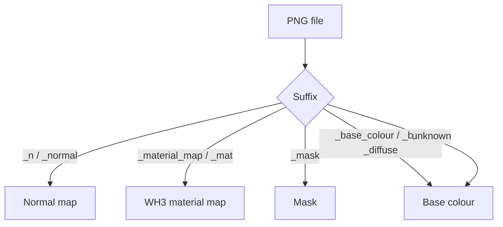

# PNG to DDS

Converts PNG textures to DDS files through `texconv.exe`.

## Auto texture type detection



## Output formats

| Kind | Format | Colour space |
|---|---|---|
| Base colour | `BC1_UNORM_SRGB` | sRGB |
| Normal | `BC3_UNORM` | linear |
| Material map | `BC1_UNORM` | linear, no alpha |
| Mask | `BC1_UNORM` | linear |

## Total War orange normals

When **Convert blue normal maps to TW orange normal maps** is enabled, the tool changes normal maps with this channel mapping:

```text
R = 255
G = original G
B = 0
A = original R
```

That matches the common Total War orange-normal workflow used when converting a standard blue tangent-space normal for TW assets.
