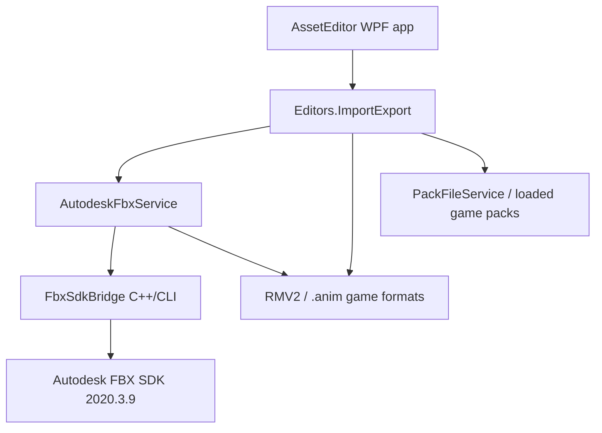
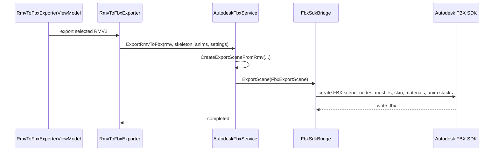
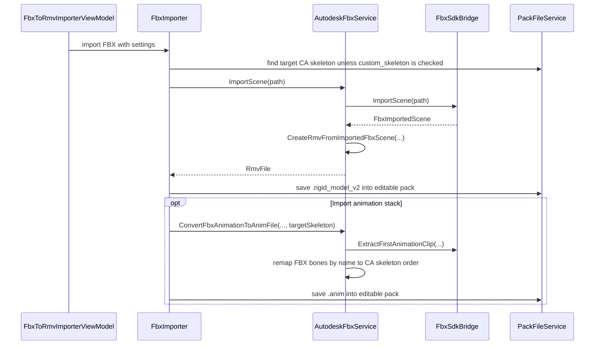
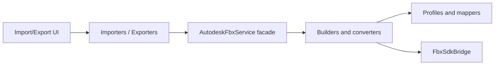

# Autodesk FBX Integration Developer Guide

This document explains how the Autodesk FBX SDK integration is structured, how to build it locally, and how to extend it safely for additional `RigidModel` / RMV2 use cases.

The current integration targets **RMV2 v7/v8-era workflows only**. Older RMV generations should be rejected or handled through a separate conversion layer because their vertex formats, material headers, and serialization rules are not equivalent.

---

## 1. Scope of the current FBX solution

The FBX integration adds a direct Autodesk SDK pipeline for:

- RMV2 -> FBX export;
- FBX -> RMV2 advanced import;
- `.anim` -> FBX export;
- first FBX animation stack -> `.anim` import;
- skeleton-aware animation roundtrip;
- skeleton bone-order remapping by name;
- Total War inch-scale FBX export/import handling;
- first-pass material and texture roundtrip;
- local runtime copy of `FbxSdkBridge.dll` and `libfbxsdk.dll` into the AssetEditor output folder.

The integration intentionally does **not** include Autodesk binaries in the repository. Developers must install Autodesk FBX SDK locally.

---

## 2. High-level architecture

The solution is split into three layers:

1. **Native bridge**: `Native/FbxSdkBridge`
2. **Managed service**: `Editors.ImportExport/Common/FbxSdk/AutodeskFbxService.cs`
3. **Import/export UI and workflow layer**: `Editors.ImportExport/Importing` and `Editors.ImportExport/Exporting`



### Why C++/CLI?

The Autodesk FBX SDK is native C++. The app is C#/.NET. The bridge avoids exposing raw native pointers to the C# projects and gives the C# layer simple managed DTOs such as:

- `FbxImportedScene`
- `FbxImportedMesh`
- `FbxImportedVertex`
- `FbxExportScene`
- `FbxExportMesh`
- `FbxExportBone`
- `FbxAnimationClip`
- `FbxAnimationFrame`

The C# side should never directly manipulate FBX SDK objects. All FBX SDK ownership, manager lifetime, scene loading, scene exporting, animation stack evaluation, and unit conversion belong in `FbxSdkBridge`.

---

## 3. Required local setup

### 3.1 Install Autodesk FBX SDK

Install Autodesk FBX SDK 2020.3.9 at the default path:

```text
C:\Program Files\Autodesk\FBX\FBX SDK\2020.3.9
```

Expected folders:

```text
C:\Program Files\Autodesk\FBX\FBX SDK\2020.3.9\include
C:\Program Files\Autodesk\FBX\FBX SDK\2020.3.9\lib\x64\debug
C:\Program Files\Autodesk\FBX\FBX SDK\2020.3.9\lib\x64\release
```

Expected files:

```text
libfbxsdk.lib
libfbxsdk.dll
```

### 3.2 Visual Studio workloads

Install:

- .NET desktop development;
- Desktop development with C++;
- MSVC v143 x64 build tools;
- C++/CLI support.

The native bridge must be built as **x64**. Do not use AnyCPU for the native project.

### 3.3 Override the SDK path when needed

Both the native bridge project and the app project use `FbxSdkRoot`.

Default:

```xml
<FbxSdkRoot Condition="'$(FbxSdkRoot)'==''">C:\Program Files\Autodesk\FBX\FBX SDK\2020.3.9</FbxSdkRoot>
```

Override from MSBuild:

```powershell
dotnet build .\AssetEditor.sln -p:FbxSdkRoot="D:\SDKs\Autodesk\FBX\FBX SDK\2020.3.9"
```

For Visual Studio, add the property in a local `.props` file or set it in the project environment.

---

## 4. Solution integration points

### 4.1 Solution file

The native project must be present in `AssetEditor.sln` as a Visual C++ project:

```text
Native\FbxSdkBridge\FbxSdkBridge.vcxproj
```

### 4.2 Editors.ImportExport project reference

`Editors.ImportExport.csproj` references the bridge:

```xml
<ProjectReference Include="..\..\..\Native\FbxSdkBridge\FbxSdkBridge.vcxproj" />
```

This lets C# code use the managed C++/CLI namespace:

```csharp
using AssetEditor.Native.FbxSdkBridge;
```

### 4.3 AssetEditor runtime copy

`AssetEditor.csproj` copies the bridge runtime files into the app output folder:

```text
FbxSdkBridge.dll
FbxSdkBridge.pdb
libfbxsdk.dll
```

This is required because `AssetEditor.exe` loads `Editors.ImportExport`, which loads `FbxSdkBridge.dll`, which in turn depends on `libfbxsdk.dll`.

If `libfbxsdk.dll` is missing from the final output folder, FBX features will fail at runtime even if the solution compiles.

---

## 5. Build order

Recommended order:

```text
1. Native/FbxSdkBridge
2. Editors.ImportExport
3. AssetEditor
```

From Visual Studio:

1. Set solution platform to `x64`.
2. Build `FbxSdkBridge`.
3. Build `Editors.ImportExport`.
4. Build `AssetEditor`.

From command line:

```powershell
msbuild .\Native\FbxSdkBridge\FbxSdkBridge.vcxproj /p:Configuration=Debug /p:Platform=x64
msbuild .\Editors\ImportExportEditor\Editors.ImportExport\Editors.ImportExport.csproj /p:Configuration=Debug /p:Platform=x64
msbuild .\AssetEditor\AssetEditor.csproj /p:Configuration=Debug /p:Platform=x64
```

---

## 6. Data flow: RMV2 -> FBX



Key conversion responsibilities:

| Stage | Responsibility |
|---|---|
| `RmvToFbxExporter` | Resolve selected pack file, destination path, skeleton, animation files, user settings. |
| `AutodeskFbxService.CreateExportSceneFromRmv` | Convert RMV models, bones, materials, animation frames into bridge DTOs. |
| `FbxSdkBridge.ExportScene` | Create Autodesk FBX SDK scene, units, nodes, meshes, clusters, materials, textures, animation curves. |

### 6.1 Units

Total War skeleton exports are written in inch-style FBX units. This is intentional.

Important rule:

- internal RMV / `.anim` translation values are treated as game/internal units;
- exported FBX uses inch scale for Blender-friendly Total War skeleton display;
- imported animation translations must be converted back if Blender preserves inch numeric values in a meter scene.

Do not scatter unit conversion across importers. Keep unit logic centralized in `FbxSdkBridge` and `AutodeskFbxService`.

### 6.2 Mesh orientation

The export settings expose orientation options because Blender and Total War do not use the same practical convention for editing skeletons and meshes.

Current defaults are chosen for Blender editing. When adding another DCC target later, do not hardcode another branch directly in exporters. Add a named profile.

Recommended future structure:

```csharp
public sealed record FbxCoordinateProfile(
    bool MirrorMeshX,
    bool MirrorSkeletonX,
    bool MirrorAnimationX,
    bool ExportInches,
    bool BlenderFriendlyUvs);
```

---

## 7. Data flow: FBX -> RMV2



### 7.1 Skeleton matching

Default behavior must search **CA / All Game Packs** first.

The editable mod pack should not be used as the default skeleton source. Custom skeletons are only included when the `custom_skeleton` option is enabled.

Rationale:

- most imports should target the game's real skeleton order;
- `.anim` files are index-based, so bone order matters;
- using the imported FBX hierarchy order breaks animation playback;
- using a mod pack skeleton by accident can silently corrupt the result.

### 7.2 Bone remap rule

For `.anim` import:

```text
Never write dynamic frames in FBX traversal order.
Always write frames in the target CA skeleton order.
Map FBX curves by normalized bone name to target skeleton bone index.
```

This is the key rule that fixed the animation roundtrip.

---

## 8. Texture and material roundtrip

### 8.1 Export behavior

When texture export is enabled:

- referenced RMV textures are found in loaded packs;
- DDS files are copied next to the FBX into a `<fbx-name>_textures/` folder;
- FBX materials receive standard texture links;
- FBX materials also receive custom properties named like `AE_Texture_<TextureType>`.

The custom properties help preserve exact RMV texture slot intent through Blender, because Blender may not preserve every FBX channel exactly as authored.

### 8.2 Import behavior

When material import is enabled:

- standard FBX material texture channels are read;
- `AE_Texture_<TextureType>` custom properties are read;
- DDS files are imported directly;
- PNG/JPG/etc. are converted through the existing PNG-to-DDS importer;
- material texture slots are filled under the destination texture folder.

### 8.3 Texture slot mapping

Keep texture type mapping in one place. Do not duplicate string mapping in the bridge and in C#.

Recommended approach:

```csharp
private static readonly Dictionary<string, TextureType> TextureAliases = new(StringComparer.OrdinalIgnoreCase)
{
    ["Diffuse"] = TextureType.Diffuse,
    ["BaseColor"] = TextureType.Diffuse,
    ["Normal"] = TextureType.Normal,
    ["Specular"] = TextureType.Specular,
};
```

When adding new slots, add:

1. RMV `TextureType` mapping;
2. export custom property name;
3. FBX channel fallback;
4. import path normalization;
5. a roundtrip test.

---

## 9. Animation export/import rules

### 9.1 Frame count and duration are separate

Do not assume:

```text
AnimationTotalPlayTimeInSec == (frameCount - 1) / frameRate
```

Real Total War `.anim` files may have a fractional tail after the last sampled frame.

Correct behavior:

- preserve the original `.anim` duration when exporting `.anim` -> FBX;
- set FBX stack time span to that duration;
- when importing FBX -> `.anim`, use the FBX stack duration if available;
- only fallback to `(frameCount - 1) / frameRate` when no duration metadata exists.

### 9.2 Quaternion handling

A quaternion and its negated equivalent represent the same orientation. However, sign flips can hurt interpolation in some tools.

Recommended future hardening:

- normalize all quaternions;
- optionally enforce continuity frame-to-frame by flipping a quaternion when its dot product with the previous frame is negative;
- do not use this as a substitute for correct bone remapping.

### 9.3 Root motion

Root motion usually lives on one of:

```text
animroot
root
```

When mirroring animations or changing coordinate profiles, root translation may need a separate axis inversion rule. Keep this explicit and configurable.

---

## 10. Supporting additional RMV2 rigid model types

The current code handles the main v7/v8-era static and weighted/cinematic paths. To support additional RMV2 model types, add a profile-driven conversion instead of adding random `if` blocks.

### 10.1 Identify the target model type

For every new model type, document:

| Item | What to check |
|---|---|
| RMV version | Must be v7/v8 for this solution. Reject older versions. |
| Vertex format | Static, weighted, cinematic, cloth, decal, terrain, etc. |
| Material header | `ModelMaterialEnum`, material class, shader expectations. |
| Bone usage | No skeleton, skeleton with skin weights, attachment-only, or special matrix palette. |
| Texture slots | Which RMV texture types are required and optional. |
| Index limits | Whether the mesh still fits RMV2 ushort index limits. |
| Tangents | Whether `TangentBasisCalculator` is valid for the type. |

### 10.2 Add a model conversion profile

Recommended pattern:

```csharp
internal sealed record RmvFbxModelProfile(
    string Name,
    RmvVersionEnum Version,
    VertexFormat VertexFormat,
    ModelMaterialEnum MaterialId,
    bool RequiresSkeleton,
    bool RequiresFourWeights,
    bool SupportsTextureRoundtrip,
    bool SupportsAnimationRoundtrip);
```

Then route conversion through a resolver:

```csharp
private static RmvFbxModelProfile ResolveProfile(RmvModel model)
{
    // Inspect RMV version, material id, vertex format and skeleton usage.
    // Return a supported profile or throw a clear NotSupportedException.
}
```

### 10.3 Export implementation checklist

When exporting a new model type:

1. Confirm the RMV model can be represented as triangular FBX mesh data.
2. Convert positions, normals, UVs, indices.
3. Preserve winding order under mirror settings.
4. Convert material metadata into a stable FBX material name and custom properties.
5. Export texture references where possible.
6. Export skin clusters only if the type is actually skinned.
7. Preserve LOD index in mesh names: `lod0_...`, `lod1_...`.
8. Reject unsupported vertex layouts with an explicit exception.

### 10.4 Import implementation checklist

When importing to a new model type:

1. Decide the target RMV profile before creating vertices.
2. Validate the FBX mesh has enough data: positions, normals, UVs.
3. If skinned, resolve the target CA skeleton first.
4. Map FBX bone weights by bone name to target skeleton index.
5. Enforce the exact weight count expected by the RMV writer.
6. Build the correct material header type.
7. Normalize texture pack paths.
8. Recalculate tangents and bounding boxes.
9. Recalculate RMV offsets.
10. Save to the editable pack only after the conversion succeeds.

### 10.5 Handling v7/v8 only

Add early guards. Do not let unsupported files fail deep inside vertex writers.

Example policy:

```csharp
private static void EnsureSupportedRmvVersion(RmvFile rmvFile)
{
    if (rmvFile.Header.Version is not RmvVersionEnum.RMV2_V7 and not RmvVersionEnum.RMV2_V8)
        throw new FbxExportNotSupportedException($"FBX export supports only RMV2 v7/v8. Found {rmvFile.Header.Version}.");
}
```

Use the same idea on import when the target game or output format implies an older model version.

---

## 11. Error handling policy

Errors should be clear and close to the failing feature.

Good examples:

```text
FBX import failed: no mesh found in scene.
FBX animation import skipped: no matching CA skeleton was found.
FBX export not supported for RMV version RMV2_V5.
FBX import failed: cinematic vertices require exactly four weights.
```

Bad examples:

```text
External component has thrown an exception.
Object reference not set to an instance of an object.
Index was outside the bounds of the array.
```

Bridge public entry points should wrap native exceptions and throw managed exceptions with useful messages.

---

## 12. Testing matrix

Before calling a new RMV2 type supported, test all rows that apply:

| Test | Export | Import | Roundtrip | Notes |
|---|---:|---:|---:|---|
| Static prop, one material | Yes | Yes | Yes | No skeleton. |
| Static prop, multiple materials | Yes | Yes | Yes | Confirms material split. |
| Multi-LOD model | Yes | Yes | Yes | Confirms `lodX_` grouping. |
| Weighted character mesh | Yes | Yes | Yes | Confirms skeleton and weights. |
| Cinematic four-weight mesh | Yes | Yes | Yes | Confirms writer expectations. |
| Texture DDS roundtrip | Yes | Yes | Yes | Confirms pack texture paths. |
| PNG/JPG import to DDS | No | Yes | Partial | Depends on existing converter. |
| `.anim` only export | Yes | No | No | Export selected `.anim`. |
| FBX animation stack import | No | Yes | Yes | Requires matching CA skeleton. |
| Blender edit roundtrip | Yes | Yes | Yes | Main user scenario. |

---

## 13. Recommended future structure for scaling

As support grows, split `AutodeskFbxService` into smaller focused classes. Avoid turning it into a permanent god class.

Suggested structure:

```text
Common/FbxSdk/
  AutodeskFbxService.cs
  FbxSceneExportBuilder.cs
  FbxSceneImportConverter.cs
  FbxAnimationExportBuilder.cs
  FbxAnimationImportConverter.cs
  FbxMaterialTextureMapper.cs
  FbxCoordinateProfile.cs
  RmvFbxModelProfile.cs
  RmvFbxProfileResolver.cs
```

Target dependency direction:



Keep `AutodeskFbxService` as the facade used by the rest of the app. Move details into testable helpers.

---

## 14. Common build failures

### `libfbxsdk.dll` missing at runtime

Cause:

- runtime DLL not copied to `AssetEditor\bin\...`;
- wrong `FbxSdkRoot`;
- building AnyCPU instead of x64.

Fix:

- build x64;
- verify `FbxSdkRoot`;
- rebuild `FbxSdkBridge`;
- verify `libfbxsdk.dll` is next to `AssetEditor.exe`.

### `LNK2019` unresolved FBX SDK symbols

Cause:

- `libfbxsdk.lib` not linked;
- wrong library directory;
- `FBXSDK_SHARED` missing.

Fix:

- check `FbxSdkBridge.vcxproj` include/library dirs;
- confirm `FBXSDK_SHARED` is defined;
- confirm debug builds link against `lib\x64\debug` and release against `lib\x64\release`.

### `FbxTakeInfo::Create` or `FbxDocumentInfo::AddTakeInfo` not found

Cause:

- those APIs are not available in the installed FBX SDK 2020.3.9.

Fix:

- do not use those APIs;
- set animation duration via `FbxAnimStack` start/stop properties and scene timeline span.

### `CS0006` missing project DLLs

Cause:

- usually a cascade from an earlier real compile error.

Fix:

- fix the first non-`CS0006` error;
- rebuild the failed project first.

---

## 15. Pull request checklist

Before merging an FBX extension:

- [ ] Builds in Debug x64.
- [ ] Builds in Release x64.
- [ ] `FbxSdkBridge.dll` is copied to app output.
- [ ] `libfbxsdk.dll` is copied to app output.
- [ ] No Autodesk binaries are committed.
- [ ] Unsupported RMV versions fail early with a clear message.
- [ ] New model type has a documented profile.
- [ ] Texture mappings are centralized.
- [ ] Bone remapping uses target skeleton order, not FBX hierarchy order.
- [ ] Animation duration is preserved independently of frame count.
- [ ] Blender roundtrip was manually tested.
- [ ] Import failure does not leave half-created files in the editable pack.

