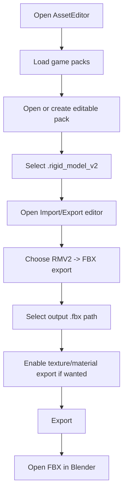
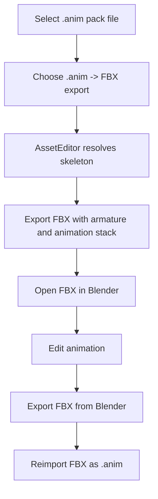
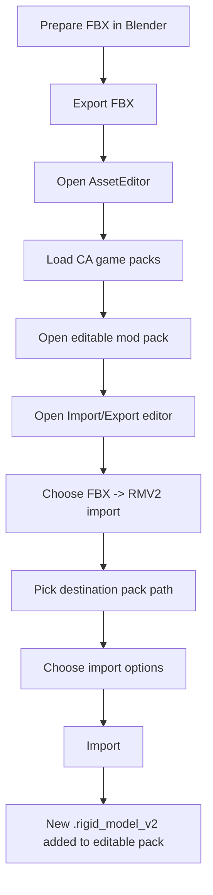
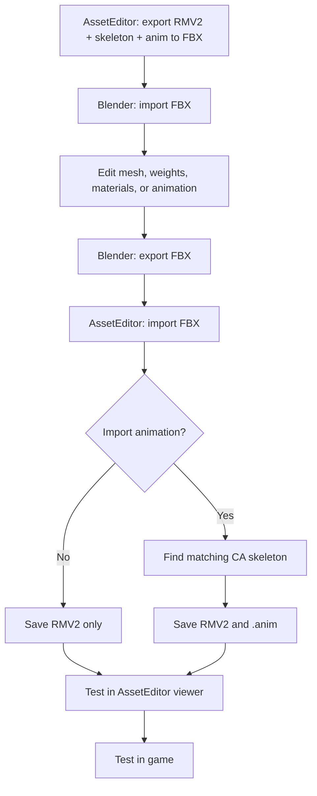

# AssetEditor FBX Import/Export User Guide

This guide explains how to use the new Autodesk FBX features in AssetEditor for RMV2 models and `.anim` files.

The workflows are designed mainly for **modern Total War RMV2 v7/v8 assets** and Blender editing.

---

## 1. What the new FBX features do

You can now:

- export RMV2 models directly to FBX;
- export `.anim` files directly to FBX;
- edit exported FBX files in Blender;
- reimport FBX models as RMV2;
- optionally import the first FBX animation stack as a `.anim` file;
- roundtrip basic material and texture references;
- keep Total War skeleton scale correct through Blender;
- keep animation bone order compatible with the game skeleton.

---

## 2. Required setup before using FBX features

For normal users of a prebuilt release, this should already be handled by the app package.

For local developer builds, the app folder must contain:

```text
AssetEditor.exe
FbxSdkBridge.dll
libfbxsdk.dll
```

If FBX features crash on start or when exporting, verify that `libfbxsdk.dll` is next to `AssetEditor.exe`.

---

## 3. Recommended Blender settings

Use Blender for editing only. Do not apply random object-scale fixes unless needed.

Recommended FBX import behavior in Blender:

- keep the armature and meshes together;
- do not rename final bones unless you know how to restore them;
- avoid applying negative object scale to the armature;
- preserve the animation action if doing animation roundtrip;
- export as FBX again after editing.

The exporter/importer handles the Total War inch-scale issue. If the model looks correct in Blender, do not manually scale it by `39.37` or `0.0254` unless you are intentionally doing a custom conversion.

---

## 4. Export RMV2 model to FBX

### 4.1 Basic workflow



### 4.2 Texture export

When texture export is enabled, the exporter tries to copy referenced DDS textures next to the FBX:

```text
my_model.fbx
my_model_textures\
  texture_01.dds
  texture_02.dds
```

The FBX material also stores texture links and AssetEditor texture metadata. This makes it easier to reimport the FBX after Blender edits.

### 4.3 Skeleton export

If a matching skeleton is found, the FBX contains:

- skeleton bones;
- skinned mesh data;
- weights;
- optional animation stacks if exporting with animations.

If no skeleton is found, the model may still export as a static mesh, but animation roundtrip will not be possible.

---

## 5. Export `.anim` to FBX

Use this when you want to edit an existing game animation in Blender.



Important notes:

- The exported FBX should keep the original animation duration.
- The number of sampled frames and the play duration are not always identical concepts.
- Do not delete or rename bones if you plan to import the animation back.

---

## 6. Import FBX as RMV2

### 6.1 Basic workflow



### 6.2 Important: load CA game packs first

For skinned models and animation import, AssetEditor must have access to the original CA skeleton files.

If you see a warning that no matching skeleton was found:

1. make sure the correct game is selected;
2. make sure all CA game packs are loaded;
3. check the FBX skeleton name;
4. only enable `custom_skeleton` if you intentionally want to use a skeleton from your mod pack.

### 6.3 `custom_skeleton` option

Default behavior:

```text
Search CA / All Game Packs skeletons only.
```

With `custom_skeleton` checked:

```text
Also allow skeletons from editable/mod packs.
```

Use `custom_skeleton` only for custom rigs. For normal game skeletons, leave it unchecked.

---

## 7. Import FBX animation as `.anim`

When importing an FBX, you can optionally import the first animation stack as a `.anim` file.

Recommended use:

- export an existing `.anim` to FBX;
- edit it in Blender;
- export from Blender;
- import the FBX back with animation import enabled.

The importer writes the `.anim` using the target Total War skeleton bone order. This is important because `.anim` frames are index-based.

### 7.1 Why bone names matter

The importer does this:

```text
FBX bone name -> matching CA skeleton bone name -> CA skeleton bone index
```

It does **not** write bones in Blender hierarchy order.

So bone names must stay compatible with the target skeleton.

### 7.2 Duration handling

The importer preserves FBX animation duration when available.

Example:

```text
37 frames at 20 FPS does not necessarily mean exactly 1.800000 seconds.
```

Some Total War animations have a small fractional tail after the last sampled frame. The importer/exporter tries to preserve that metadata.

---

## 8. Material and texture roundtrip

### 8.1 Exporting textures

When exporting RMV2 -> FBX with textures enabled:

- DDS textures are copied beside the FBX;
- FBX materials get texture links;
- extra AssetEditor custom texture properties are written.

### 8.2 Editing in Blender

You can edit materials and texture references, but keep these points in mind:

- DDS support in Blender may depend on your setup;
- if Blender rewrites texture links, keep the files near the FBX;
- avoid deleting material slots unless you want the imported RMV2 material layout to change.

### 8.3 Importing textures

When importing FBX -> RMV2 with materials enabled:

- DDS files are imported directly;
- PNG/JPG files are converted to DDS through the existing importer;
- texture paths are written under the destination texture folder.

---

## 9. Mirroring an animation in Blender

For left-handed to right-handed animation edits, mirror the **pose/action**, not the whole object scale.

### 9.1 Manual single-pose method

1. Select the armature.
2. Enter **Pose Mode**.
3. Select all pose bones.
4. Use **Pose → Copy Pose**.
5. Use **Pose → Paste Pose Flipped**.
6. Insert keyframes.

### 9.2 Whole-action script

Select the armature, open Blender's **Scripting** tab, paste this, and run it:

```python
import bpy

armature = bpy.context.object

if armature is None or armature.type != "ARMATURE":
    raise RuntimeError("Select the armature first.")

action = armature.animation_data.action if armature.animation_data else None

if action is None:
    raise RuntimeError("The selected armature has no active action.")

mirrored_action = action.copy()
mirrored_action.name = action.name + "_mirrored_LR"
armature.animation_data.action = mirrored_action

frames = sorted({
    int(round(key.co.x))
    for fcurve in mirrored_action.fcurves
    for key in fcurve.keyframe_points
})

if not frames:
    raise RuntimeError("No keyframes found in the active action.")

bpy.ops.object.mode_set(mode="POSE")

for bone in armature.data.bones:
    bone.select = True
armature.data.bones.active = armature.data.bones[0]

scene = bpy.context.scene

for frame in frames:
    scene.frame_set(frame)
    bpy.ops.pose.copy()
    bpy.ops.pose.paste(flipped=True)

    for pose_bone in armature.pose.bones:
        pose_bone.keyframe_insert(data_path="location", frame=frame)

        if pose_bone.rotation_mode == "QUATERNION":
            pose_bone.keyframe_insert(data_path="rotation_quaternion", frame=frame)
        elif pose_bone.rotation_mode == "AXIS_ANGLE":
            pose_bone.keyframe_insert(data_path="rotation_axis_angle", frame=frame)
        else:
            pose_bone.keyframe_insert(data_path="rotation_euler", frame=frame)

        pose_bone.keyframe_insert(data_path="scale", frame=frame)

scene.frame_set(frames[0])
print(f"Created mirrored action: {mirrored_action.name}")
```

### 9.3 Bone naming warning

Blender's flipped paste works best with `.L` / `.R` style names.

Total War-style names often use:

```text
upperarm_left / upperarm_right
hand_left / hand_right
foot_left / foot_right
```

If flipped paste does not work correctly, temporarily rename bones in Blender to `.L` / `.R`, mirror the animation, then restore the original names before final export.

Do not import a final `.anim` with renamed bones unless your target skeleton also uses those names.

### 9.4 Root motion warning

After mirroring, check:

```text
animroot
root
```

If the character attacks correctly but moves sideways in the wrong direction, invert the lateral root translation curve in Blender's Graph Editor.

---

## 10. Recommended Blender roundtrip workflow



Recommended order:

1. First test mesh-only export/import.
2. Then test material/texture roundtrip.
3. Then test animation export/import.
4. Then test Blender edits.
5. Then test in game.

Do not debug every feature at once.

---

## 11. Troubleshooting

### FBX export creates no file

Check:

- the output path is writable;
- `FbxSdkBridge.dll` is next to `AssetEditor.exe`;
- `libfbxsdk.dll` is next to `AssetEditor.exe`;
- you are using an RMV2 v7/v8-style model.

### FBX import says no matching skeleton found

Check:

- correct game selected;
- CA game packs loaded;
- FBX skeleton name matches the expected game skeleton;
- `custom_skeleton` is only enabled when needed.

### Imported animation is huge

This was usually caused by inch/meter mismatch. Current builds should auto-fix the common Blender roundtrip case.

Do not manually scale the armature unless you are sure the current importer did not already handle it.

### Imported animation is twisted or broken

Most likely causes:

- bones were renamed in Blender;
- wrong target skeleton was used;
- FBX has a different skeleton hierarchy than the original;
- animation curves were applied to helper bones instead of real skeleton bones.

### Mesh imports but animation does not

Check:

- the FBX has at least one animation stack;
- animation import is enabled;
- a matching CA skeleton was found;
- the armature bones still use game-compatible names.

### Textures do not show in Blender

Check:

- textures were exported beside the FBX;
- Blender can read the texture format;
- texture links are still valid after moving the FBX;
- the `<fbx-name>_textures` folder was not moved or deleted.

### Textures do not come back into AssetEditor

Check:

- import materials option is enabled;
- source texture files still exist;
- texture paths are not absolute paths to deleted temp folders;
- PNG/JPG conversion works independently through the existing importer.

---

## 12. Known limitations

- Older RMV versions are not the target of this FBX workflow.
- Not every exotic material type is fully roundtripped.
- Texture roundtrip is first-pass and depends on texture links surviving DCC edits.
- Only the first FBX animation stack is imported as `.anim` by the current workflow.
- Complex Blender rigs with constraints/controllers should be baked to normal bone keyframes before export.
- Custom skeleton workflows require careful naming and matching.

---

## 13. Safe editing rules

For best results:

- keep bone names unchanged;
- keep the skeleton hierarchy unchanged unless intentionally making a custom skeleton;
- avoid applying negative scale to the armature object;
- keep FBX and texture folder together;
- test mesh import before animation import;
- test small changes first;
- keep a backup of the original `.anim` and `.rigid_model_v2`.

