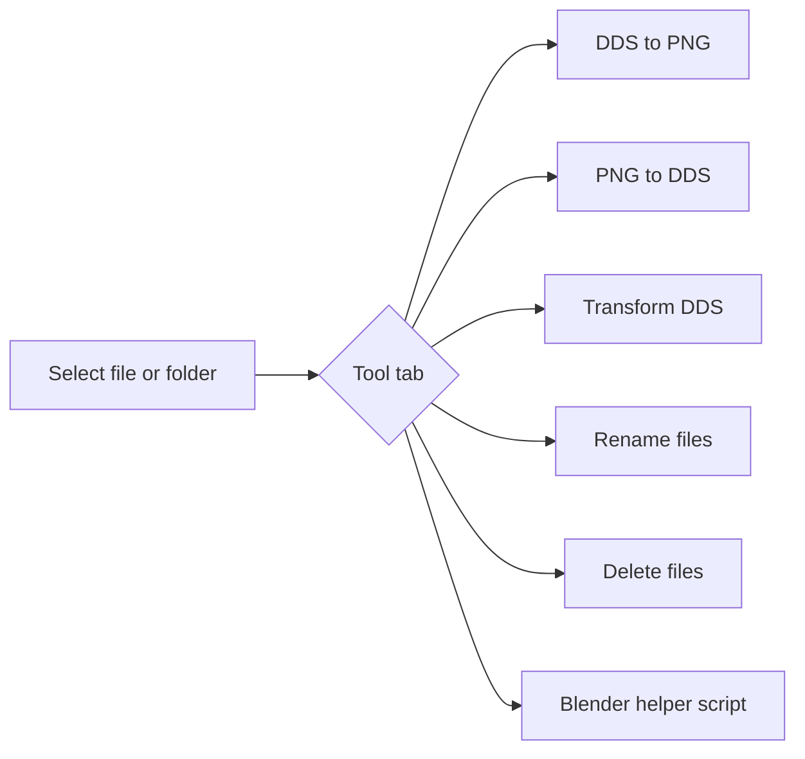

# Texture/File Tools

AssetEditor includes a lightweight replacement for the old standalone Python utilities used for Total War texture and file housekeeping. The tool is available from **Tools → Texture/File Tools**.



The tool uses Microsoft `texconv.exe` for DDS encoding/decoding. Set the path at the top of the tool before converting textures. The default path is:

```text
C:\Dev\TexConv\texconv.exe
```

## Safe workflow

Use the conversion checkboxes deliberately:

| Task | Texture kind | Channel options |
|---|---|---|
| Only change DDS to PNG format | Any | Turn normal/material conversion off |
| Only change PNG to DDS format | Any | Turn normal/material conversion off |
| Standard Blender/glTF normal PNG to CA/TW DDS | Normal | `Convert blue/purple normal maps to TW-orange normal maps` on |
| CA/TW orange normal DDS to Blender PNG | Normal | `Convert TW-orange normal maps to Blender blue normal maps` on |
| Blender/glTF-like material map to CA/WH3 layout | MaterialMap | `Swap material-map R/B channels` on |
| Already CA/WH3 material map | MaterialMap | `Swap material-map R/B channels` off |

The material-map swap is not a specular/gloss combiner. It only swaps channels on one already prepared material-map image.

## Texture naming conventions

Auto-detection uses common Total War suffixes:

| Suffix | Kind | DDS output |
|---|---|---|
| `_n`, `_normal`, `_normal_map` | normal map | `BC3_UNORM`, linear |
| `_material_map`, `_mat_map`, `_mat` | WH3 material map | `BC1_UNORM`, linear |
| `_mask`, `_msk` | mask | `BC1_UNORM`, linear |
| `_base_colour`, `_basecolor`, `_bc`, `_diffuse`, `_d` | base colour | `BC1_UNORM_SRGB`, sRGB |

Unknown names are treated as `BaseColour` in Auto mode. Select the texture kind manually if the filename is ambiguous.

## Normal map rules

For standard blue/purple Blender normals converted to Total War orange normals, the integrated conversion follows the old Python tool rule:

```text
R = 255
G = source G
B = 0
A = source R
```

For CA/TW orange normals exported to Blender-editable PNG, the tool uses the same channel conversion as the FBX texture export path.

## Material map rules

Warhammer III material maps replace the old separate specular/gloss workflow. The texture is compressed as `BC1_UNORM` and is treated as data, not as base colour. The optional material-map conversion checkbox swaps R/B channels for workflows where the source image uses Blender/glTF-like channel order.

## File safety

Rename and delete actions have `Dry run` enabled by default. Keep it enabled for the first pass and check the log before modifying files.
