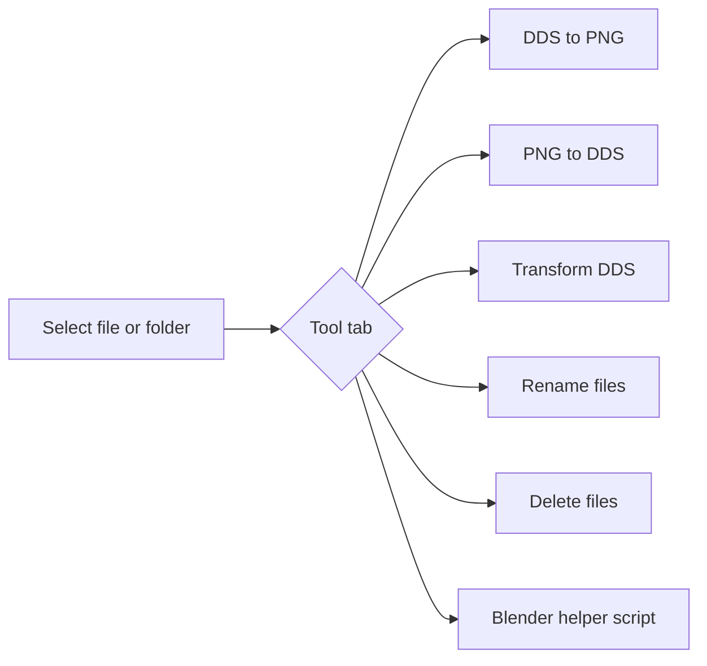

# Texture/File Tools

AssetEditor includes a lightweight replacement for the old standalone Python utilities used for Total War texture and file housekeeping. The tool is available from the top menu under **Tools → Texture/File Tools**.



The tool uses Microsoft `texconv.exe` for DDS encoding/decoding. Set the path at the top of the tool before converting textures. The default path is:

```text
C:\Dev\TexConv\texconv.exe
```

## Texture naming conventions

Auto-detection uses common Total War suffixes:

| Suffix | Kind | DDS output |
|---|---|---|
| `_n`, `_normal`, `_normal_map` | normal map | `BC3_UNORM`, linear |
| `_material_map`, `_mat_map`, `_mat` | WH3 material map | `BC1_UNORM`, linear |
| `_mask`, `_msk` | mask | `BC1_UNORM`, linear |
| `_base_colour`, `_basecolor`, `_bc`, `_diffuse`, `_d` | base colour | `BC1_UNORM_SRGB`, sRGB |

## WH3 texture notes

Warhammer III uses a metal/roughness workflow. The old diffuse texture is replaced by base colour, and material maps replace the old specular/gloss role. Material maps should be saved as BC1 without alpha. Normal maps and masks stay conceptually separate from this conversion flow.

For Total War orange normal maps, the integrated conversion follows the channel workflow commonly used by modders: copy the blue-style normal red channel into alpha, set red to white, keep green, and set blue to black.
