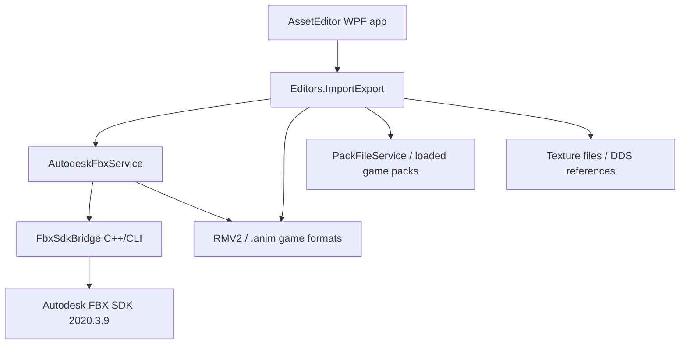
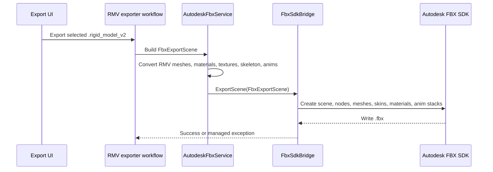
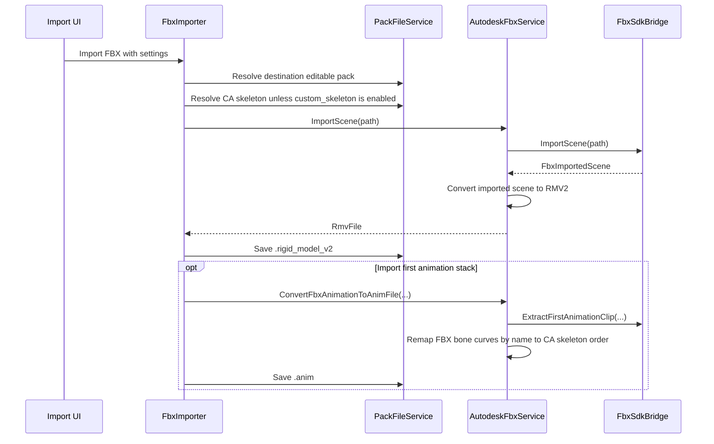

# AssetEditor Autodesk FBX Integration - Developer Guide

This document explains how the Autodesk FBX import/export integration is structured, how to build it locally, and how to scale it to additional modern Total War `RigidModel` / RMV2 v7-v8 workflows.

The current scope is deliberately limited to **RMV2 v7/v8-era assets**. Older rigid model generations must be rejected or routed through a separate compatibility layer because their vertex layouts, material metadata, texture slots, skeleton conventions, and serialization rules are not equivalent.

---

## 1. Goals and non-goals

### Supported goals

The FBX integration provides a direct Autodesk SDK pipeline for:

- RMV2 v7/v8 -> FBX export;
- FBX -> RMV2 v7/v8 advanced import;
- `.anim` -> FBX export;
- first FBX animation stack -> `.anim` import;
- skeleton-aware animation roundtrip;
- CA skeleton bone-order remapping by name;
- Total War / Blender scale handling;
- material and texture reference roundtrip;
- local runtime copy of `FbxSdkBridge.dll` and Autodesk `libfbxsdk.dll` into the AssetEditor output folder.

### Explicit non-goals

Do not treat this pipeline as a universal Total War model converter yet.

Unsupported or intentionally limited cases:

- RMV versions older than v7;
- unknown vertex formats without a dedicated mapping strategy;
- automatic WH2 -> WH3 texture conversion;
- automatic shader or `.wsmodel` material migration;
- arbitrary custom skeleton retargeting;
- reliable animation mirroring / left-right handed animation conversion.

---

## 2. Architecture overview

The solution is split into three layers.



| Layer | Location | Responsibility |
|---|---|---|
| Native bridge | `Native/FbxSdkBridge` | Owns Autodesk FBX SDK objects, scene import/export, node creation, animation curve sampling, FBX units, and native exception handling. |
| Managed conversion service | `Editors.ImportExport/Common/FbxSdk/AutodeskFbxService.cs` | Converts between bridge DTOs and AssetEditor game-format models. Handles RMV vertices, materials, texture references, animation files, bone remapping, and validation. |
| Workflow/UI layer | `Editors.ImportExport/Importing` and `Editors.ImportExport/Exporting` | Resolves pack files, user settings, paths, skeleton files, import/export commands, warnings, and final pack writes. |

The C# layer must never directly manipulate Autodesk FBX SDK objects. Keep all native FBX manager, scene, node, geometry, material, animation stack, and SDK lifetime concerns inside `FbxSdkBridge`.

---

## 3. Autodesk FBX SDK setup

### 3.1 Required SDK version

Use Autodesk FBX SDK **2020.3.9**.

Default install path:

```text
C:\Program Files\Autodesk\FBX\FBX SDK\2020.3.9
```

Expected structure:

```text
C:\Program Files\Autodesk\FBX\FBX SDK\2020.3.9\include
C:\Program Files\Autodesk\FBX\FBX SDK\2020.3.9\lib\x64\debug
C:\Program Files\Autodesk\FBX\FBX SDK\2020.3.9\lib\x64\release
```

Required files:

```text
libfbxsdk.lib
libfbxsdk.dll
```

Autodesk DLLs must **not** be committed to the repository. They are copied from the local SDK install during build.

### 3.2 Visual Studio requirements

Install:

- .NET desktop development;
- Desktop development with C++;
- MSVC v143 x64 build tools;
- C++/CLI support.

The bridge must be built as **x64**. `AnyCPU` is not valid for `FbxSdkBridge`.

### 3.3 SDK path override

Projects use an MSBuild property named `FbxSdkRoot`.

Default:

```xml
<FbxSdkRoot Condition="'$(FbxSdkRoot)'==''">C:\Program Files\Autodesk\FBX\FBX SDK\2020.3.9</FbxSdkRoot>
```

Override from command line:

```powershell
dotnet build .\AssetEditor.sln -p:FbxSdkRoot="D:\SDKs\Autodesk\FBX\FBX SDK\2020.3.9"
```

For Visual Studio, set the same property in a local `.props` file or in the project environment.

---

## 4. Solution integration checklist

### 4.1 Solution file

The native project must be part of `AssetEditor.sln`:

```text
Native\FbxSdkBridge\FbxSdkBridge.vcxproj
```

Use the Visual C++ project type GUID, not a C# project type GUID.

### 4.2 Native bridge project settings

`FbxSdkBridge.vcxproj` must use:

- platform: `x64`;
- C++/CLI enabled;
- MSVC v143;
- include directory: `$(FbxSdkRoot)\include`;
- library directory: `$(FbxSdkRoot)\lib\x64\debug` or `release`;
- dependency: `libfbxsdk.lib`;
- preprocessor definition: `FBXSDK_SHARED`.

The `FBXSDK_SHARED` definition is required when linking against the shared Autodesk FBX SDK library.

### 4.3 Managed project reference

`Editors.ImportExport.csproj` references the bridge:

```xml
<ProjectReference Include="..\..\..\Native\FbxSdkBridge\FbxSdkBridge.vcxproj" />
```

This lets the managed service use:

```csharp
using AssetEditor.Native.FbxSdkBridge;
```

### 4.4 Runtime copy

`AssetEditor.csproj` must copy these files to the final app output folder:

```text
FbxSdkBridge.dll
FbxSdkBridge.pdb
libfbxsdk.dll
```

Runtime layout:

```text
AssetEditor.exe
Editors.ImportExport.dll
FbxSdkBridge.dll
libfbxsdk.dll
```

If `libfbxsdk.dll` is missing beside `AssetEditor.exe`, FBX features can compile but fail at runtime.

### 4.5 Build order

Recommended build order:

```text
1. Native/FbxSdkBridge
2. Editors.ImportExport
3. AssetEditor
```

Visual Studio:

1. Set solution platform to `x64`.
2. Build `FbxSdkBridge`.
3. Build `Editors.ImportExport`.
4. Build `AssetEditor`.

Command line example:

```powershell
msbuild .\Native\FbxSdkBridge\FbxSdkBridge.vcxproj /p:Configuration=Debug /p:Platform=x64
msbuild .\Editors\ImportExportEditor\Editors.ImportExport\Editors.ImportExport.csproj /p:Configuration=Debug /p:Platform=x64
msbuild .\AssetEditor\AssetEditor.csproj /p:Configuration=Debug /p:Platform=x64
```

---

## 5. Data flow: RMV2 -> FBX



Key responsibilities:

| Component | Responsibility |
|---|---|
| Export workflow | Resolve selected pack file, destination path, skeleton, animation files, texture export options. |
| `AutodeskFbxService` | Convert RMV model data into bridge DTOs. |
| `FbxSdkBridge` | Create actual FBX SDK objects and write the file. |

---

## 6. Data flow: FBX -> RMV2



---

## 7. Core animation rules

### 7.1 Never write `.anim` frames in FBX traversal order

Total War `.anim` frames are index-based. The index order must match the target skeleton file.

Correct rule:

```text
FBX bone name -> normalized bone name -> matching CA skeleton bone -> CA skeleton index
```

Then write dynamic translation and rotation frames in **CA skeleton order**.

Do not use:

```text
FBX hierarchy traversal order
Blender visual hierarchy order
FBX node creation order
```

### 7.2 Skeleton source rules

Default search:

```text
CA / All Game Packs only
```

When `custom_skeleton` is enabled:

```text
CA / All Game Packs + editable/mod pack skeletons
```

The editable pack should not be searched first by default. Accidentally using a mod skeleton can create a valid-looking `.anim` that is index-compatible with the wrong skeleton.

### 7.3 Duration is metadata, not just frame count

Do not blindly write:

```text
AnimationTotalPlayTimeInSec = (frameCount - 1) / frameRate
```

A 37-frame animation at 20 FPS may still store a play duration slightly above `1.8` seconds. Preserve the FBX animation stack duration when available, and only fall back to frame-count-derived duration when the FBX does not provide usable timing metadata.

### 7.4 Scale handling

The export/import pipeline handles the Total War / Blender inch-scale mismatch.

Rules:

- Do not scatter ad-hoc `39.3700787` or `0.0254` conversions through unrelated code.
- Keep FBX scene unit interpretation in `FbxSdkBridge`.
- Keep game-format value normalization in `AutodeskFbxService`.
- Validate with animation dumps by comparing translation magnitudes against a known original `.anim`.

---

## 8. Blender FBX contract

The integration is designed around Blender roundtrip editing, especially for rigged models and animation clips.

### 8.1 Import into Blender

Users should import the FBX normally and avoid manual scale fixes. If the model looks correct in Blender, the data should not be multiplied by `39.37` or `0.0254` by hand.

### 8.2 Export from Blender

The user guide exposes these recommended settings. The implementation should assume this contract when possible:

| Blender FBX export option | Recommended value |
|---|---|
| Include | `Selected Objects` enabled |
| Object Types | `Armature` and `Mesh` for rigged models; `Armature` is enough for animation-only reimport |
| Transform Scale | `1.00` |
| Manual unit scaling | Do not apply manual `39.37` / `0.0254` fixes |
| Armature > Add Leaf Bones | disabled |
| Armature > Only Deform Bones | disabled |
| Bake Animation | enabled for animation export |
| Bake Animation > NLA Strips | disabled for a single edited action |
| Bake Animation > All Actions | disabled unless intentionally exporting several actions |
| Bake Animation > Force Start/End Keying | enabled |
| Bake Animation > Sampling Rate | `1` |
| Bake Animation > Simplify | `0.0` |

Why `Only Deform Bones` should stay disabled: Total War skeletons can use prop bones, attachment bones, skirt/cape bones, and other non-obvious nodes that still matter for game compatibility or animation import. Removing them changes the skeleton contract.

---

## 9. Texture and material handling

### 9.1 WH3 texture model

Warhammer III moved away from the older WH2 gloss/specular workflow toward a metal/roughness-style workflow. In practical modding terms:

- old diffuse becomes / is replaced by base colour;
- base colour can include information that used to be represented through specular for metallic surfaces;
- material map replaces old specular and gloss behavior;
- material map is generally a green/orange map without alpha;
- orange indicates reflective/metal regions;
- green indicates rough/non-reflective regions;
- normal maps and masks are not conceptually replaced by this WH3 conversion step.

Source reference: Total War Modding wiki, `Tutorial:Updating textures to WH3`.

### 9.2 What the FBX roundtrip should and should not do

The FBX integration should preserve texture references and material slot intent. It should **not** silently perform WH2 -> WH3 artistic texture conversion.

Correct scope:

- preserve or copy existing DDS references;
- preserve RMV texture slot metadata where possible;
- write FBX material texture links for Blender convenience;
- write custom AssetEditor FBX properties when standard FBX material channels are not expressive enough;
- import edited texture paths back into the RMV/material metadata when possible.

Out of scope:

- generating proper WH3 base colour from WH2 diffuse/specular automatically;
- generating material maps from WH2 gloss/specular automatically;
- changing `.wsmodel` XML shader definitions automatically;
- deciding metalness/roughness artistically.

### 9.3 Texture format notes

For WH3-oriented workflows:

| Texture role | Practical notes |
|---|---|
| Base colour | Save as DX10+ sRGB DDS when applicable; preserve alpha and mipmaps when needed. |
| Material map | Save as BC1 with no alpha for the common WH3 material-map workflow. |
| Normal map | Do not treat it as a standard blue OpenGL/DirectX normal without checking the Total War channel convention. TW-style orange normal maps can use red copied to alpha, red painted white, and blue painted black. |
| Mask | Keep a valid mask slot; missing masks can cause incorrect texture lookup or visual glitches. |

### 9.4 RMV / material slots

When scaling the importer/exporter to new RMV v7/v8 material variants, inspect the existing material slot names and texture semantics before mapping them to FBX channels.

Do not assume every game uses the same set of slots.

Recommended strategy:

```csharp
public interface IRmvMaterialFbxAdapter
{
    bool CanHandle(RmvFile file, RmvModel model, RmvMesh mesh);
    FbxExportMaterial ExportMaterial(...);
    void ImportMaterial(...);
}
```

Then add adapters per game/material family instead of hardcoding every texture rule into one method.

---

## 10. Scaling to additional RMV2 v7/v8 rigid model types

When adding support for another modern rigid model variant, treat it as a new compatibility profile.

### 10.1 Add a profile, not a pile of conditionals

Recommended structure:

```csharp
public sealed record RmvFbxCompatibilityProfile(
    GameTypeEnum Game,
    int RmvVersion,
    string VertexFormatName,
    bool SupportsSkinning,
    bool SupportsFourWeights,
    bool SupportsVertexColours,
    bool SupportsTangents,
    bool SupportsMaterials,
    bool SupportsAnimationRoundtrip);
```

Use this profile to route mesh, material, and animation conversion decisions.

### 10.2 Validate before conversion

Before export/import, validate:

- RMV version is v7 or v8;
- mesh vertex format is known;
- index buffer format is supported;
- skinned meshes have valid weights;
- skeleton is present when required;
- material layout is recognized;
- texture slot names are understood;
- target game is selected correctly.

Fail fast with an actionable error. Do not produce a broken model silently.

### 10.3 Vertex conversion checklist

For each new vertex format, map:

- position;
- normal;
- tangent / bitangent if present;
- UV0 and any additional UV sets;
- vertex colour if present;
- blend weights;
- blend indices;
- material index / mesh part metadata;
- any game-specific packed fields.

For cinematic/skinned vertices, ensure imported weights are normalized and padded/truncated to the exact count expected by the RMV writer.

### 10.4 Material conversion checklist

For each new material type, map:

- material name;
- shader/material ID;
- texture slot list;
- base colour / diffuse equivalent;
- material map / specular/gloss equivalent when applicable;
- normal map;
- mask map;
- blood/emissive/extra slots when present;
- flags and boolean parameters that the RMV or `.wsmodel` path expects.

Do not infer WH3 material maps from WH2 gloss/specular unless the feature is explicitly implemented and exposed to the user.

### 10.5 Skeleton/animation checklist

For rigged models and animations:

- resolve skeleton from CA packs first;
- allow mod skeletons only through `custom_skeleton`;
- normalize bone names before matching;
- preserve target skeleton order;
- preserve or reconstruct parent IDs from the target skeleton, not from Blender hierarchy alone;
- preserve animation duration metadata;
- handle missing FBX curves by using reference/rest transforms;
- validate dynamic frame counts and mapping lengths.

---

## 11. Error handling and diagnostics

Native exceptions should be converted into managed exceptions with useful messages.

Recommended bridge pattern:

```cpp
try
{
    // FBX SDK work
}
catch (const std::exception& ex)
{
    throw gcnew System::InvalidOperationException(gcnew System::String(ex.what()));
}
catch (...)
{
    throw gcnew System::InvalidOperationException("Unknown native FBX SDK error.");
}
```

Importer diagnostics should report:

- selected game;
- editable pack;
- whether `custom_skeleton` is enabled;
- skeleton name requested;
- number of CA skeleton candidates scanned;
- best skeleton match and score;
- texture files copied or missing;
- material slots imported or skipped;
- animation stack name, frame rate, sampled frames, and duration.

---

## 12. Testing matrix

At minimum, test these workflows:

| Workflow | Expected result |
|---|---|
| Static RMV2 export -> Blender | Mesh appears at correct scale with materials/texture links. |
| Static FBX import -> RMV2 | Model writes back without skeleton requirement. |
| Rigged RMV2 export -> Blender | Armature and weights appear correct. |
| Rigged FBX import -> RMV2 | Weights are valid for the target RMV vertex type. |
| `.anim` export -> Blender | Action plays on the correct skeleton. |
| Blender animation export -> `.anim` import | Bone order, scale, duration, and root motion remain compatible. |
| Texture roundtrip | Existing DDS references survive unless user intentionally changes them. |
| WH3 material reference | Base colour/material map/normal/mask slots remain semantically correct. |

For animation fixes, compare dumped `.anim` text before and after roundtrip:

- same skeleton name;
- same bone count;
- same bone order;
- same mapping count;
- similar translation magnitudes;
- preserved or intentionally changed duration;
- quaternions valid and normalized.

---

## 13. Common build failures

### `libfbxsdk.dll` missing at runtime

The app starts but FBX import/export crashes.

Fix: ensure `libfbxsdk.dll` is copied beside `AssetEditor.exe`.

### Unresolved FBX SDK symbols

Usually caused by missing `FBXSDK_SHARED` or wrong library path.

Fix: verify preprocessor definitions and link path.

### `CS0006` metadata file missing

Usually a cascade after `FbxSdkBridge` or `Editors.ImportExport` failed first.

Fix the first real compile error, then rebuild.

### C++ FBX SDK API missing, such as `FbxTakeInfo::Create`

FBX SDK 2020.3.9 does not expose every helper found in examples for other versions. Prefer setting animation stack start/stop and scene timeline directly instead of relying on unavailable take-info helpers.

---

## 14. Source notes

Texture workflow notes are based on the Total War Modding wiki page `Tutorial:Updating textures to WH3`. The important engineering point is that AssetEditor should preserve texture references and slot semantics, but should not pretend that FBX roundtrip automatically performs artistic WH2 -> WH3 texture conversion.
