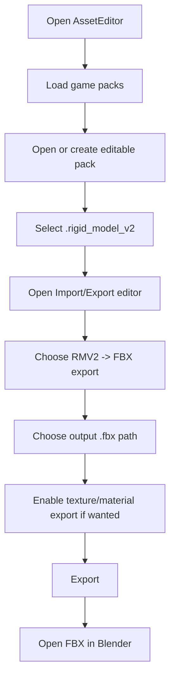
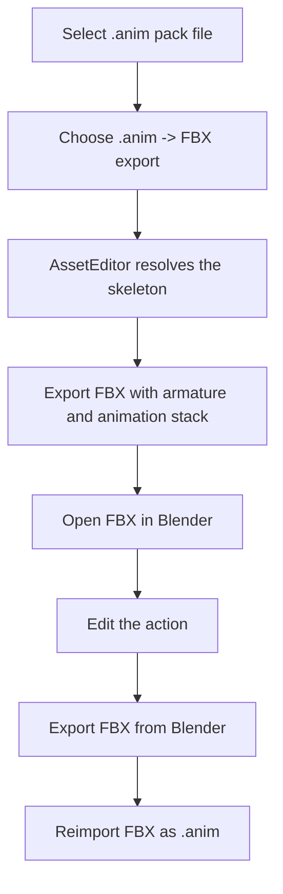
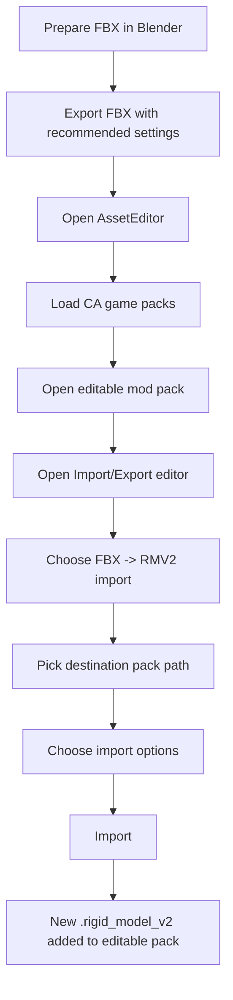

# AssetEditor FBX Import/Export User Guide

This guide explains how to use the Autodesk FBX features in AssetEditor for modern Total War RMV2 models and `.anim` files.

The workflows are designed mainly for **RMV2 v7/v8 assets** and Blender editing. Older rigid model versions are not covered by this workflow.

---

## 1. What the FBX features can do

You can now use AssetEditor to:

- export RMV2 models directly to FBX;
- export `.anim` files directly to FBX;
- edit exported FBX files in Blender;
- reimport FBX models as RMV2;
- optionally import the first FBX animation stack as a `.anim` file;
- preserve skeleton scale through Blender roundtrip;
- preserve animation bone order by matching against the target Total War skeleton;
- preserve basic material and texture references.

The feature is intended for Blender roundtrip editing, not for fully automatic game-to-game asset conversion.

---

## 2. Runtime requirements

For a normal packaged release, everything should already be included.

For a local developer build, the AssetEditor output folder must contain:

```text
AssetEditor.exe
FbxSdkBridge.dll
libfbxsdk.dll
```

If FBX features crash immediately when used, check that `libfbxsdk.dll` is beside `AssetEditor.exe`.

---

## 3. Recommended Blender FBX settings

### 3.1 Importing FBX into Blender

Use Blender normally. Do not apply manual scale fixes unless you know exactly why.

Recommended behavior:

- keep the armature and meshes together;
- do not rename bones if you plan to import the animation or rigged model back;
- do not apply negative object scale to the armature;
- do not manually multiply or divide scale by `39.37` or `0.0254`;
- keep the animation action if you are doing animation roundtrip.

If the model looks correct in Blender, leave the scale alone.

### 3.2 Exporting FBX from Blender

These settings are important for rigged models and animations.

For a rigged model roundtrip, select the armature and the meshes before export.

For animation-only roundtrip, exporting the armature is enough, but keeping the mesh visible while editing helps verify the pose.

Recommended Blender FBX export settings:

| Blender section | Option | Recommended value |
|---|---|---|
| Include | Selected Objects | enabled |
| Include | Object Types | `Armature` + `Mesh` for rigged models; `Armature` for animation-only export |
| Transform | Scale | `1.00` |
| Transform | Apply manual scale conversion | no manual `39.37` / `0.0254` fix |
| Armature | Add Leaf Bones | disabled |
| Armature | Only Deform Bones | disabled |
| Bake Animation | Bake Animation | enabled when exporting animation |
| Bake Animation | NLA Strips | disabled for a single edited action |
| Bake Animation | All Actions | disabled unless intentionally exporting several actions |
| Bake Animation | Force Start/End Keying | enabled |
| Bake Animation | Sampling Rate | `1` |
| Bake Animation | Simplify | `0.0` |

Why these settings matter:

- `Add Leaf Bones` creates extra bones that do not exist in the game skeleton.
- `Only Deform Bones` can remove prop/socket/cloth/cape/helper bones that are still part of the Total War skeleton contract.
- `Simplify 0.0` avoids Blender reducing animation curves before AssetEditor samples them back to `.anim`.
- `Selected Objects` prevents exporting unrelated scene objects by accident.

---

## 4. Export RMV2 model to FBX

### 4.1 Basic workflow



### 4.2 Static models

For non-rigged/static models, the workflow is straightforward:

1. export the RMV2 to FBX;
2. edit the mesh in Blender;
3. export FBX from Blender;
4. import the FBX back into AssetEditor as RMV2.

### 4.3 Rigged models

For rigged models:

- keep the armature;
- keep bone names unchanged;
- keep the mesh weighted to the same skeleton;
- do not delete helper bones;
- export from Blender with `Armature` and `Mesh` object types enabled;
- disable `Add Leaf Bones`;
- disable `Only Deform Bones`.

---

## 5. Export `.anim` to FBX

Use this when you want to edit an existing game animation in Blender.



Important notes:

- Do not delete or rename bones.
- Do not add Blender leaf bones.
- Keep the edited animation as the active action when exporting.
- The exported FBX should preserve the original animation duration metadata.
- Frame count and play duration are related, but not always exactly the same. Some Total War animations have a small fractional tail after the final sampled frame.

---

## 6. Import FBX as RMV2

### 6.1 Basic workflow



### 6.2 Load CA game packs first

For skinned models and animation import, AssetEditor needs access to the original CA skeleton files.

If you see a warning that no matching skeleton was found:

1. verify the correct game is selected;
2. verify CA / All Game Packs are loaded;
3. check the FBX skeleton name;
4. enable `custom_skeleton` only if you intentionally want to use a skeleton from your mod pack.

### 6.3 `custom_skeleton`

Default behavior:

```text
Search CA / All Game Packs skeletons only.
```

With `custom_skeleton` enabled:

```text
Also allow skeletons from editable/mod packs.
```

Use `custom_skeleton` only for real custom rigs. For normal game skeletons, leave it unchecked.

---

## 7. Import FBX animation as `.anim`

When importing an FBX, you can optionally import the first animation stack as a `.anim` file.

Recommended roundtrip:

1. export an existing `.anim` to FBX;
2. edit the action in Blender;
3. export FBX from Blender using the recommended animation settings;
4. import the FBX back with animation import enabled.

The importer writes the `.anim` using the target Total War skeleton bone order. This is important because `.anim` frames are index-based.

### 7.1 Why bone names matter

The importer uses this mapping:

```text
FBX bone name -> matching CA skeleton bone name -> CA skeleton bone index
```

It does not write the `.anim` in Blender hierarchy order.

So bone names must stay compatible with the target skeleton.

### 7.2 Duration handling

The importer preserves FBX animation duration when available.

Example:

```text
37 frames at 20 FPS does not always mean exactly 1.800000 seconds.
```

Some Total War animations store a small fractional duration tail after the last sampled frame. AssetEditor tries to preserve that metadata.

---

## 8. Texture and material roundtrip

### 8.1 What texture roundtrip means

FBX material/texture roundtrip is meant to preserve references and make Blender editing easier.

It does not automatically convert old WH2 texture workflows into correct WH3 material workflows.

When exporting RMV2 -> FBX with texture/material export enabled:

- referenced DDS textures can be copied beside the FBX;
- FBX materials can link to those texture files;
- AssetEditor-specific metadata can preserve the intended RMV texture slots.

When importing FBX -> RMV2 with material import enabled:

- the importer tries to restore material and texture references;
- existing DDS files are the safest input;
- non-DDS conversion depends on the existing texture import path and should be checked manually.

### 8.2 WH3 texture expectations

For Warhammer III, do not think in the old WH2 diffuse/specular/gloss layout.

Practical WH3 notes:

| Texture role | Notes |
|---|---|
| Base colour | Replaces the old diffuse role. It can include information that used to be carried by specular for metal surfaces. |
| Material map | Replaces old specular/gloss behavior. It is generally a green/orange texture with no alpha. Orange is reflective/metal; green is rough/non-reflective. |
| Normal map | Conceptually unchanged by the WH3 texture conversion step, but Total War normal maps often use the orange channel layout. |
| Mask | Conceptually unchanged and should still be present when the model/material expects it. |

### 8.3 Saving texture files

Recommended practical notes for WH3-oriented work:

| Texture | Suggested save behavior |
|---|---|
| Base colour | DDS DX10+ sRGB when applicable; preserve alpha if the material needs it; generate mipmaps. |
| Material map | BC1 DDS, no alpha, for the common WH3 material-map workflow. |
| Normal map | Check the Total War orange normal-map convention before saving. A common workflow is red copied to alpha, red painted white, blue painted black. |
| Mask | Keep it valid and referenced. Missing masks can cause incorrect visuals or wrong texture fetching. |

### 8.4 Updating old WH2-style textures

If you are updating old WH2 assets to WH3:

- old diffuse is not enough on its own;
- old specular/gloss information may need to be merged or translated into base colour and material map work;
- material maps are not just normal diffuse textures;
- the result usually needs manual artistic checking;
- `.wsmodel` XML/material definitions may also need to be updated manually.

AssetEditor FBX roundtrip can help preserve and move texture references, but it is not a full artistic conversion tool.

---

## 9. Common problems

### FBX export or import crashes immediately

Check that the app folder contains:

```text
FbxSdkBridge.dll
libfbxsdk.dll
```

### Model is huge after animation reimport

This usually indicates unit conversion failed. Rebuild with the latest bridge and verify the exported FBX was not manually scaled in Blender.

### Animation plays but body parts are wrong

Likely causes:

- skeleton was not matched correctly;
- bone names were changed;
- wrong `custom_skeleton` behavior;
- Blender exported extra leaf bones;
- Blender removed non-deform bones.

### Animation length is slightly different

Small differences can happen if a tool recomputes duration from frame count. The current roundtrip preserves FBX duration metadata when available.

### Textures look wrong in WH3

Texture reference roundtrip and WH3 texture conversion are different things. Verify that the model uses WH3-style base colour/material map slots and that the DDS formats are correct.

---

## 10. Safe roundtrip checklist

Before importing back into AssetEditor:

- CA game packs are loaded;
- editable pack is open;
- target game is correct;
- bones were not renamed;
- `Add Leaf Bones` was disabled in Blender export;
- `Only Deform Bones` was disabled for rigged model export;
- animation was exported with Bake Animation enabled;
- Simplify is set to `0.0` for animation export;
- texture files are beside the FBX or paths still resolve;
- WH3 material slots use base colour/material map/normal/mask expectations;
- `custom_skeleton` is disabled unless using a real custom skeleton.

---

## 11. Source note

The WH3 texture notes in this guide are based on the Total War Modding wiki page `Tutorial:Updating textures to WH3`. The important takeaway is that WH3 base colour and material map workflows are not the same as older diffuse/specular/gloss workflows.
